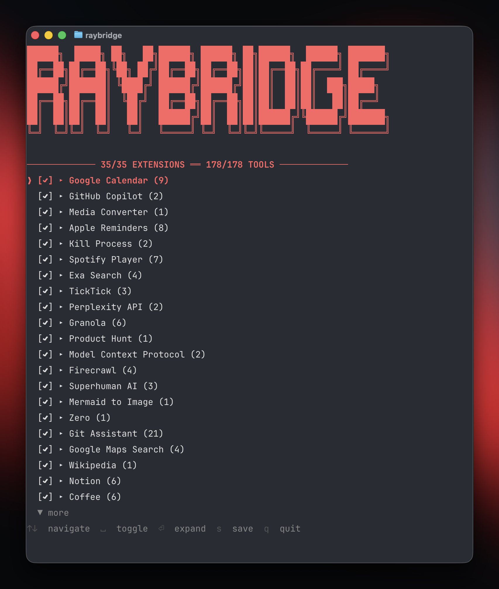

# RayBridge

MCP server that bridges Raycast extensions to any MCP-compatible client.

Discovers locally installed Raycast extensions, loads their tool definitions, and serves them over the [Model Context Protocol](https://modelcontextprotocol.io/) via stdio or HTTP.



## How it works

1. Scans `~/.config/raycast/extensions/` for installed extensions with `tools` definitions
2. Loads OAuth tokens from Raycast's encrypted SQLite database
3. Registers tools as MCP tools accessible to any MCP client

Extensions that use Raycast UI APIs (`List`, `Detail`, `Form`, etc.) are supported — the UI components are shimmed to no-ops so the underlying tool logic can execute headlessly. Extensions whose tools perform background work (API calls, data lookups, transformations) work best.

## Setup

### Prerequisites

- [Bun](https://bun.sh)
- [Raycast](https://raycast.com) installed with extensions
- `sqlcipher` CLI (for OAuth token access): `brew install sqlcipher`

### Install

```bash
bun install
```

### Configure MCP client

**Claude Code** (`~/.claude/settings.json`):

```json
{
  "mcpServers": {
    "raybridge": {
      "command": "bun",
      "args": ["run", "src/index.ts"],
      "cwd": "/path/to/raybridge"
    }
  }
}
```

**Cursor** (`~/.cursor/mcp.json`):

```json
{
  "mcpServers": {
    "raybridge": {
      "command": "bun",
      "args": ["run", "src/index.ts"],
      "cwd": "/path/to/raybridge"
    }
  }
}
```

### HTTP Transport

The server can also run as an HTTP server for remote MCP clients.

**Start the server:**

```bash
# Default: http://0.0.0.0:3000
bun run start:http

# Custom host/port
MCP_PORT=8080 MCP_HOST=0.0.0.0 bun run start:http

# With API key authentication
MCP_API_KEY=your-secret-key bun run start:http

# CLI flags also work
bun run src/index.ts --http --port 8080 --host 0.0.0.0
```

**Endpoints:**

| Endpoint | Method | Description |
|----------|--------|-------------|
| `/health` | GET | Health check (no auth required) |
| `/mcp` | POST | MCP requests (requires auth if `MCP_API_KEY` set) |
| `/mcp` | DELETE | Terminate session |

**Authentication:**

When `MCP_API_KEY` is set, requests to `/mcp` must include a Bearer token (per MCP spec):
```
Authorization: Bearer your-secret-key
```

**Example session:**

```bash
# 1. Initialize session (capture session ID from response header)
curl -X POST http://127.0.0.1:3000/mcp \
  -H "Content-Type: application/json" \
  -H "Accept: application/json, text/event-stream" \
  -H "Authorization: Bearer your-secret-key" \
  -d '{"jsonrpc":"2.0","id":1,"method":"initialize","params":{
    "protocolVersion":"2024-11-05",
    "capabilities":{},
    "clientInfo":{"name":"my-client","version":"1.0"}
  }}'
# Response includes: mcp-session-id header

# 2. List available tools
curl -X POST http://127.0.0.1:3000/mcp \
  -H "Content-Type: application/json" \
  -H "Accept: application/json, text/event-stream" \
  -H "Authorization: Bearer your-secret-key" \
  -H "mcp-session-id: <session-id-from-step-1>" \
  -d '{"jsonrpc":"2.0","id":2,"method":"tools/list","params":{}}'

# 3. Call a tool
curl -X POST http://127.0.0.1:3000/mcp \
  -H "Content-Type: application/json" \
  -H "Accept: application/json, text/event-stream" \
  -H "Authorization: Bearer your-secret-key" \
  -H "mcp-session-id: <session-id-from-step-1>" \
  -d '{"jsonrpc":"2.0","id":3,"method":"tools/call","params":{
    "name":"web",
    "arguments":{"tool_name":"read_page","input":{"url":"https://example.com"}}
  }}'
```

Sessions auto-expire after 30 minutes of inactivity.

## CLI

RayBridge includes a CLI for managing which extensions and tools are exposed:

```bash
bun link                    # Register the raybridge command (one-time setup)

raybridge                   # Launch interactive TUI
raybridge config            # Launch interactive TUI
raybridge list              # List all extensions and their status
raybridge help              # Show help
```

The TUI allows you to:
- Toggle extensions on/off
- Expand extensions to toggle individual tools
- Switch between blocklist mode (all enabled by default) and allowlist mode
- Save configuration to `~/.config/raybridge/tools.json`

## Configuration

### Tools configuration

Control which extensions and tools are exposed via `~/.config/raybridge/tools.json`:

```json
{
  "mode": "blocklist",
  "extensions": {
    "extension-name": {
      "enabled": false
    },
    "another-extension": {
      "enabled": true,
      "tools": ["specific-tool-1", "specific-tool-2"]
    }
  }
}
```

- **blocklist mode** (default): All extensions enabled unless explicitly disabled
- **allowlist mode**: All extensions disabled unless explicitly enabled

### Extension preferences

Extensions that require configuration (API keys, personal access tokens, etc.) read from:

```
~/.config/ray-ai-tools/preferences.json
```

```json
{
  "extension-name": {
    "personalAccessToken": "your-token",
    "apiKey": "your-key"
  }
}
```

The extension name matches the `name` field in the extension's `package.json`.

## Architecture

```
src/
├── index.ts       # MCP server, tool registration, request dispatch
├── http-server.ts # HTTP transport with session management
├── cli.ts         # CLI entry point (config, list, help commands)
├── tui.tsx        # Interactive TUI for extension configuration
├── config.ts      # Tools configuration (blocklist/allowlist)
├── discovery.ts   # Scans ~/.config/raycast/extensions/ for tool definitions
├── loader.ts      # Executes local tools with Raycast API shims
├── shims.ts       # Fake @raycast/api, react, react/jsx-runtime modules
├── auth.ts        # Keychain access, SQLcipher DB decryption, OAuth tokens
└── watcher.ts     # Watches extension directories for changes, triggers reloads
```

### Tool discovery

Local extensions are discovered from `~/.config/raycast/extensions/`. Each extension's `package.json` must have a `tools` array defining available tools with names, descriptions, and input schemas. Compiled tool code lives at `tools/{toolName}.js` within each extension directory.

When duplicates exist (same extension name in multiple directories), the most recently modified version wins.

### Tool execution

Tools are loaded by installing Raycast API shims into Node's module system, then requiring the tool's compiled JS file and calling its default export with the provided input.

### Raycast API shims

The following `@raycast/api` features are shimmed:

| Feature | Behavior |
|---|---|
| `OAuth.PKCEClient` | Returns tokens from Raycast's encrypted DB |
| `getPreferenceValues()` | Returns values from `preferences.json` |
| `environment` | Provides extension name, paths, version info |
| `Cache` | In-memory key-value store |
| `showToast`, `showHUD` | No-op (logs to stderr in some cases) |
| `open`, `closeMainWindow`, `popToRoot` | No-op |
| `confirmAlert` | Returns `undefined` |
| UI components (`List`, `Detail`, `Form`, etc.) | Return `null` |
| `LocalStorage` | No-op |
| `Clipboard` | No-op |

React and JSX runtime are also shimmed with minimal mocks (`createElement` → `null`, hooks are no-ops).

### Authentication

OAuth tokens are read from Raycast's encrypted SQLite database at:

```
~/Library/Application Support/com.raycast.macos/raycast-enc.sqlite
```

The database key is retrieved from macOS Keychain and derived with a salt via SHA256. Tokens are extracted per-extension and provided to tools through the `OAuth.PKCEClient` shim.

## MCP tool schema

Extensions are grouped — each extension becomes one MCP tool. The input schema follows this pattern:

```json
{
  "tool_name": "which-tool-to-run",
  "input": { "param": "value" }
}
```

Tool descriptions include per-tool documentation, parameter details, and any extension-wide AI instructions from the extension's `ai.instructions` field.

## Limitations

- **No interactive UI** — extensions that depend on rendering Lists, Forms, or other visual components to the user won't behave meaningfully
- **No persistent LocalStorage** — shimmed as no-op; extensions relying on it lose state between calls
- **OAuth tokens are not refreshed** — expired tokens will cause failures until Raycast refreshes them
- **macOS only** — depends on macOS Keychain and Raycast's macOS app paths
